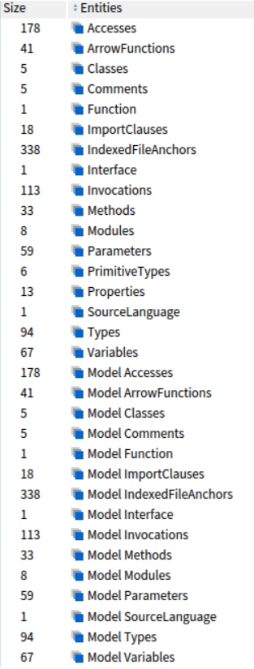
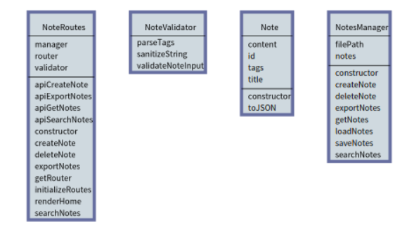
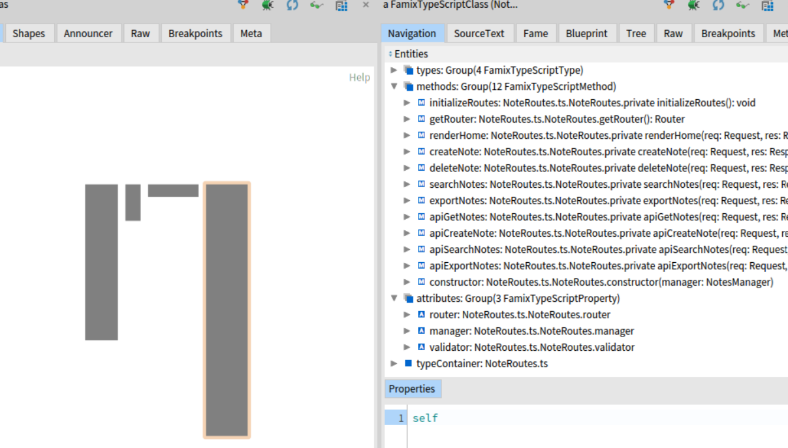
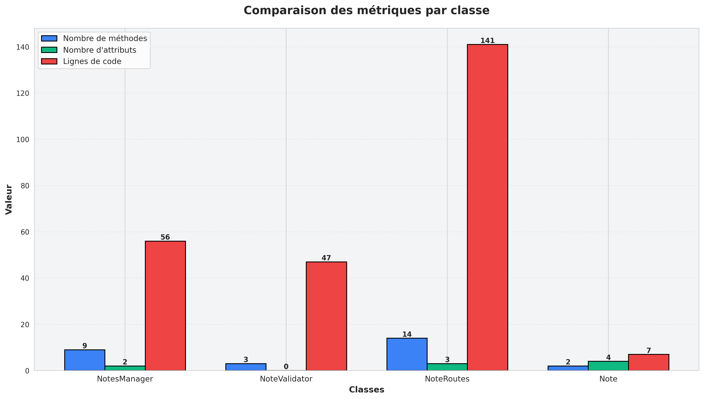
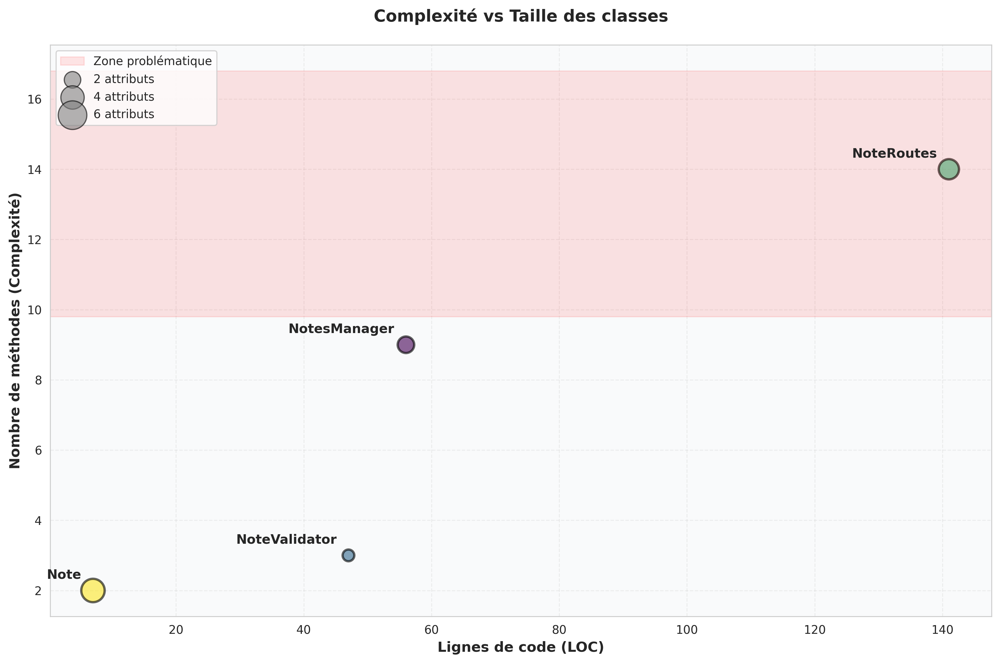
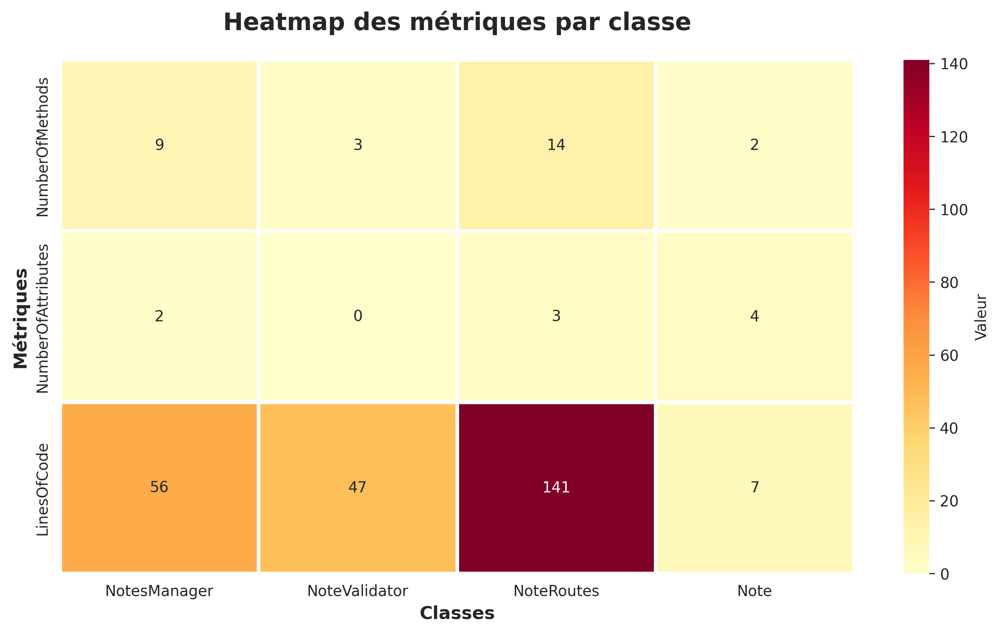
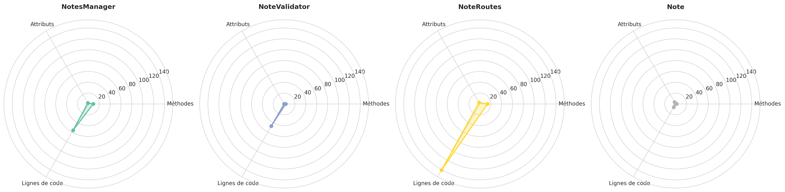

# TP2: Évaluer la qualité d’un projet TypeScript

**Cours**: MGL843  
**Titre du projet**: TP2 - Évaluer la qualité d'un projet Typescript
**Date de remise**: 23 février 2026  
**Remis à**: Professeur Christopher Fuhrman  
**Équipe 1**, 
**Auteurs**: Marc-André Besner, Stacy Chan, Ilan Hoquidant

---

## Table des matières

1. [Introduction](#introduction)
2. [Ajouter des exigences au projet TypeScript](#ajouter-des-exigences-au-projet-typescript)
3. [Visualisation et analyse des métriques](#visualisation-et-analyse-des-métriques)
4. [Références et ressources](#références-et-ressources)
---


## Introduction

L’objectif de ce TP est de rendre le projet à l’étude plus complexe afin d’approfondir les analyses qu’on va effectuer. Le projet à l’étude va avoir de nouvelles exigences et les pipelines vont être introduits pour automatiser le build et la génération des artéfacts, tel que les csv, images, etc.

## Ajouter des exigences au projet TypeScript

### Exigences ajoutées
**Question 1. Quelles sont les exigences que vous avez ajoutées ? Justifiez brièvement chaque exigence.**

Nous avons ajouté les fonctionnalités suivantes :
* La modification et la suppression des notes
    * En général, les fonctionnalités CRUD (Create, Read, Update, Modify) sont les fonctionnalités de base en gestion des données. Notre application manquait deux de ces fonctionnalités, la modification et la suppression.
* Un GUI (Graphical User interface)
    * Ayant seulement une interface CLI diminue grandement le nombre des utilisateurs qui seront à l'aise de l'utiliser
* La validation des entrées dans les champs
    * Une exigence commune pour éviter les entrées non-voulu

Ces fonctionnalités sont liées la persistance, la convivialilté, l'utilisabilité, la sécurité et la fonctionnalité. 

### Impact sur la complexité

**Question 2. Comment les exigences ajoutées augmentent-elles la complexité du projet ? Expliquez en quoi elles affectent la conception du projet par rapport aux exigences initiales (TP1)**

Les nouvelles exigences ont augmenté la complexité structurelle du projet. Voici un tableau des métriques affectées :

|  | TP1 | TP2 | Évolution |
|---|---|---|---|
| Nombre d'entités | 394 | 798 | +102% |
| Nombre de classes | 2\* | 4 | +50% |
| Nombre de méthodes | 14 |25 | +79% |
| Nombre d’attributs | 8 | 11 | +37% |
| Nombre d’invocations | 27 | 90 | +233% |
| Nombre de modules | 5 | 7 | +40% |

Les exigences ajoutées ont fait évoluer le projet d’une architecture simple, centrée sur les données et la logique, à une architecture multi-couches avec un GUI, une couche web/contrôleur et une couche de validation autour du métier.
La qualité du projet a été améliorée avec une meilleure séparation des tâches, ce qui a aussi augmentée la complexité structurelle car plus de classes et d’interactions entre les composants.

### Validation des exigences

Afin de valider les exigences ajoutées à notre projet, nous avons opté pour différents types de tests. Pour les opérations CRUD et la validation des entrées, nous avons mis en place des tests automatisés avec Jest.

## Visualisation et analyse des métriques

### Les métriques

Questions :
**1. Expliquez les métriques que vous avez choisies. Pourquoi sont-elles importantes pour évaluer la qualité de la conception ?**

Les trois métriques choisies (**NOM**, **NOA**, **LOC**) forment un triptyque d'évaluation fondamental :

1. **NOM (Nombre de Méthodes)** → Mesure de la **responsabilité**
   - Évalue combien de comportements une classe implémente
   - Nombre élevé = violation du Single Responsability Principle
   - Dans notre projet TP2 :
     - `NoteRoutes` a 14 méthodes → Classe chargée de trop de responsabilités
     - Recommandation : Refactoriser en `UIRoutes` et `APIRoutes`

2. **NOA (Nombre d'Attributs)** → Mesure de la **cohésion interne**
   - Reflète la complexité de l'état de la classe
   - Attributs multiples = risque de classe multi-rôle
   - Dans notre projet TP2 :
     - `Note` : 4 attributs - modèle de données simple
     - `NoteRoutes` : 3 attributs - contient dépendances injectées

3. **LOC (Lignes de Code)** → Mesure de la **maintenabilité**
   - Proxy pour la complexité réelle du code
   - Code long = difficile à tester, à comprendre, à maintenir
   - Dans notre projet TP2 :
     - `NoteRoutes` : 141 LOC - À optimiser
     - `NotesManager` : 56 LOC = simple et lisible


**Question 2. Si vous avez dû calculer des métriques supplémentaires, expliquez comment vous les avez calculées.**

Nous avons dérivé une métrique supplémentaire (LOC/NOM) afin d’estimer la complexité moyenne des méthodes. 

**Ratio Ligne Of Code / Nombre de méthodes (Complexité moyenne par méthode)** 

$$\text{LOC/NOM} = \frac{\text{Lignes de code}}{\text{Nombre de méthodes}}$$

| Classe | LOC | NOM | LOC/NOM | Interprétation |
|---|---|---|---|---|
| Note | 7 | 2 | 3.5 | Très bon |
| NoteValidator | 47 | 3 | 15.7 | Élevé |
| NotesManager | 56 | 9 | 6.2 | Bon |
| NoteRoutes | 141 | 14 | 10.1 | Élevé |

**Interprétation:** 
Bien que les notes de cours ne définissent pas de seuil précis pour la taille des méthodes, nous avons utilisé un ratio LOC/méthode comme indicateur dérivé. Un ratio élevé suggère des méthodes longues et potentiellement plus complexes à maintenir.


**Question 3. Quelles sont les éléments (classes, modules, méthodes, fonctions, etc.) remarquables dans le projet ? Comment les avez-vous identifiées ?**

Nous avons identifié les éléments remarquables en analysant les métriques extrêmes et les ratios significatifs. Voici les classes remarquables du projet :

#### **Classe 1: NoteRoutes - ️Classe Critique**

**Métriques:**
- Nombre de méthodes : **14** (rang 1)
- Lignes de code : **141** (rang 1)
- Nombre d'attributs : 3
- Ratio LOC/NOM : 10.1

**Identification:** 
- Cette classe est remarquable car elle est la **plus grande du projet** (141 LOC)
- Elle a le **nombre de méthodes le plus élevé** (14 méthodes)
- Elle combine plusieurs responsabilités (UI + API), ce qui viole le SRP.


**Rôle:** Classe contrôleur/router qui gère l'interface utilisateur et les routes HTTP.

---

#### **Classe 2: NotesManager - 🔵 ORCHESTRE CENTRAL**

**Métriques:**
- Nombre de méthodes : **9** (rang 2)
- Lignes de code : **56** (rang 2)
- Nombre d'attributs : 2
- Ratio LOC/NOM : 6.2

**Identification:**
- Cette classe est remarquable car elle est la **2e plus grande** en complexité
- Elle a le **2e plus haut nombre de méthodes** 
- Classe de service centrale pour la gestion des notes

**Rôle:** Gère la logique métier (CRUD, persistance, recherche).

---

#### **Classe 3: NoteValidator**

**Métriques:**
- Nombre de méthodes : 3
- Lignes de code : **47** (rang 3)
- Nombre d'attributs : **0** (seule classe sans état) ✓
- Ratio LOC/NOM : 15.7 (élevé)

**Identification:**
- Cette classe est remarquable car elle est **l'unique classe stateless** (NOA = 0)
- Elle a un **LOC/Nombre d’attributs  plus élevé que les autres classes avec   15.7 ce qui sugère que la méthodes complexes mais peu nombreuses


**Rôle:** Validateur spécialisé pour les entrées utilisateur.

---

#### **Classe 4: Note**  

**Métriques:**
- Nombre de méthodes : 2
- Lignes de code : **7** (rang 4 - plus petit)
- Nombre d'attributs : **4** (rang 1 - le plus d'attributs)
- Ratio LOC/NOM : 3.5 (excellent)

**Identification:**
- Cette classe est la plus simple avec un LOC de 7 
- Elle possède 4 attributs pour seulement 7 lignes de code, ce qui en fait une classe de données pure, centrée uniquement sur le stockage d’informations plutôt que sur la logique.
- Ratio LOC/NOM de 3.5 

**Rôle:** Modèle de données représentant une note.

---


** Question 4. Expliquez le rôle de ces éléments dans le projet. Pourquoi sont-ils importants ?**
| Classe | Rôle | Dépendances | Importance | Raison |
|---|---|---|---|---|
| **NoteRoutes** | Contrôleur/Router | → NotesManager, NoteValidator |  **CRITIQUE** | Seul point d'entrée utilisateur |
| **NotesManager** | Service métier | → Note, fs (fichiers) |  **CRITIQUE** | Gère toute la logique + persistance |
| **NoteValidator** | Validateur | → (aucune) |  **HAUTE** | Garantit l'intégrité des données |
| **Note** | Modèle de données | → (aucune) |  **MOYENNE** | Représente l'entité métier |

---


**Question 5. Commentez sur la qualité de la conception du projet. Y a-t-il des éléments qui semblent mal conçus ? Pourquoi ?**

####  **Points Forts**
- Bonne séparation des responsabilités (TP2 vs TP1)
- Classes spécialisées : `Note` simple (7 LOC), `NoteValidator` stateless
- Code lisible : ratio LOC/NOM bon pour Note (3.5) et NotesManager (6.2)

####  **Problèmes identifiés**

**1. NoteRoutes viole le SRP**
- Mélange 2 responsabilités : UI (Pug) + API (JSON)
- **Solution :** Diviser en UIRoutes et APIRoutes

**2. NotesManager mélange plusieurs responsabilités**
- Gère persistance (load/save) + logique CRUD + recherche
- Couplage fort avec le FileSystem
- **Solution :** Extraire une classe Repository pour la persistance

**3. NoteValidator a une méthode trop longue**
- validateNoteInput() → 25-30 LOC pour 3 méthodes
- Ratio LOC/NOM = 15.7 
- **Solution :** Diviser en validateTitle(), validateContent(), validateTags()

#### 📊 **Score Global : 6.6/10 (Moyen)**
- SRP violated : NoteRoutes et NotesManager
- Testabilité : Moyenne
- Maintenabilité : Moyenne
- Extensibilité : Faible

**Verdict :** Le projet montre une amélioration claire (TP2 vs TP1), mais présente des violations du SRP qui affectent la testabilité et l'extensibilité. Les refactorisations proposées amélioreront significativement la qualité.


### Analyse des éléments remarquables

1. **[`NotesManager`](tp-mgl843/notes-app/src/NotesManager.ts)** - Classe centrale de gestion des notes
   - Méthodes clés: `createNote()`, `updateNote()`, `deleteNote()`, `searchNotes()`, `exportNotes()`
   - Responsabilités: Gestion CRUD, persistance, recherche, exportation

2. **[`NoteValidator`](tp-mgl843/notes-app/src/NoteValidator.ts)** - Validation des données
   - Méthodes clés: `validateNoteInput()`, `sanitizeString()`, `parseTags()`
   - Responsabilités: Validation des entrées utilisateur, prévention des injections HTML

3. **[`NoteRoutes`](tp-mgl843/notes-app/src/NoteRoutes.ts)** - Gestion des routes HTTP
   - Responsabilités: Routage des requêtes, gestion des interactions utilisateur

4. **[`Note`](tp-mgl843/notes-app/src/Note.ts)** - Modèle de données
   - Attributs: `id`, `title`, `content`, `tags`
   - Responsabilités: Représentation d'une note

### Rôle et importance de ces éléments

| Classe | Rôle | Importance | Justification |
|--------|------|-----------|---------------|
| **NotesManager** | Orchestrateur central | **CRITIQUE** | Point d'entrée unique pour toutes les opérations sur les notes; gère la persistance des données |
| **NoteValidator** | Gardien de la qualité des données | **HAUTE** | Prévient les injections XSS, valide les contraintes métier (limites de taille, nombre de tags) |
| **NoteRoutes** | Contrôleur d'application | **HAUTE** | Interface entre l'utilisateur et la logique métier; gère toutes les interactions HTTP/formulaires |
| **Note** | Modèle de domaine | **MOYENNE** | Représente le concept métier central; structure simple mais essentielle |


#### Points forts ✓

1. **Séparation des préoccupations (TP2 amélioration)**
   - Introduction de `NoteValidator` sépare la validation de la logique métier
   - `NoteRoutes` isole le contrôle des requêtes HTTP
   - Meilleure que TP1 où tout était dans `NotesManager`

2. **Validation robuste des entrées**
   - Vérification des longueurs: titre (≤200), contenu (≤5000), tags (≤50)
   - Limite de 10 tags par note
   - Échappement HTML pour prévenir les injections XSS
   - Tests exhaustifs dans [`tp2.test.ts`](tp-mgl843/notes-app/src/tests/tp2.test.ts)

3. **Persistance des données**
   - Sauvegarde automatique après chaque modification
   - Chargement au démarrage
   - Préservation des données entre les sessions

4. **Interface utilisateur conviviale**
   - GUI avec Pug au lieu de CLI uniquement
   - Messages de succès/erreur clairs
   - Opérations CRUD complètes (Create, Read, Update, Delete)


#### Points faibles ✗

1. **[`NotesManager`](tp-mgl843/notes-app/src/NotesManager.ts) viole le Single Responsibility Principle**
   ```
   Responsabilités identifiées:
   - Persistance (loadNotes, saveNotes)
   - Logique métier (createNote, updateNote, deleteNote, getNotes)
   - Recherche (searchNotes)
   - Exportation (exportNotes)
   ```
   → **Suggestion d'amélioration:** Refactoriser en 4 classes:
   - `NotesRepository`: Persistance
   - `NotesManager`: Logique CRUD
   - `NotesSearcher`: Recherche
   - `NotesExporter`: Exportation

2. **Gestion des erreurs limitée**
   - Pas de gestion d'exceptions lors de la lecture/écriture de fichiers
   - Erreurs silencieuses possibles
   ```typescript
   // Exemple: pas de try-catch dans loadNotes()
   private loadNotes(): void {
     // Risque si notes.json est corrompu
   }
   ```

3. **Pas de validation au niveau du format JSON**
   - Chargement direct sans vérification de structure
   - Vulnérable aux fichiers malformés

4. **Méthodes longues de validation**
   - `validateNoteInput()` dans [`NoteValidator`](tp-mgl843/notes-app/src/NoteValidator.ts) pourrait être divisée en sous-méthodes


### Les visualisations

Nous avons créé des visualisations à partir de Roassal et Python.

**Figure 1: Exemple des attributs obtenus de Moose**




**Figure 2: Diagramme UML venant de Roassal**



```
Cette visualisation montre les classes du projet, leurs attributs et leurs méthodes
```


**Figure 3: Visualisation avec Roassal comparant les attributs et méthodes par classe**


```
Cette visualisation complète montre :
- Toutes les classes du projet
- La centralité des classes (largeur et hauteur des boîtes proportionnelle à l'importance)
-- La largeur représente le nombre des attributs dans la classe
-- La hauteur représente le nombre des méthodes dans la classe
```

**Figure 4 : Exemple des métriques venant de Moose**



```
Avec Moose, on voit le nombre d’attributs et méthodes par classe
```

* *Figure 5 : Graphique comparant les métriques par classe**



**Figure 6 : Graphique comparant la complexité et la taille par classe**



**Figure 7 : Heatmap des métriques**



**Figure 8 : Graphique radar des métriques**




### Références et ressources

Nos répertoires sont les suivantes :
* https://github.com/mab001/tp-mgl843
    * les pipelines cicd (lancements des tests, génération du modèle famix en json)
    * le code source de l’application TypeScript se trouve dans le dossier notes-app
* https://github.com/mab001/tpmgl853-moose-equipe1.git
    * le code source Pharo
    * les pipelines pour la génération de .csv de Moose et la génération des visualisations venant du script Python

Ressources utilisées :
- **Tutoriel ts2famix**: https://fuhrmanator.github.io/tuto-Famix-ts/
- **Documentation Famix**: http://Famix.org/
- **Roassal**: https://roassal.github.io/
- **NeoCSV Pharo**: https://github.com/svenvc/NeoCSV
- **Iceberg Pharo**: https://iceberg.githubusercontentload.com/
- **GitHub Copilot**: https://github.com/features/copilot
- **TypeScript**: https://www.typescriptlang.org/


